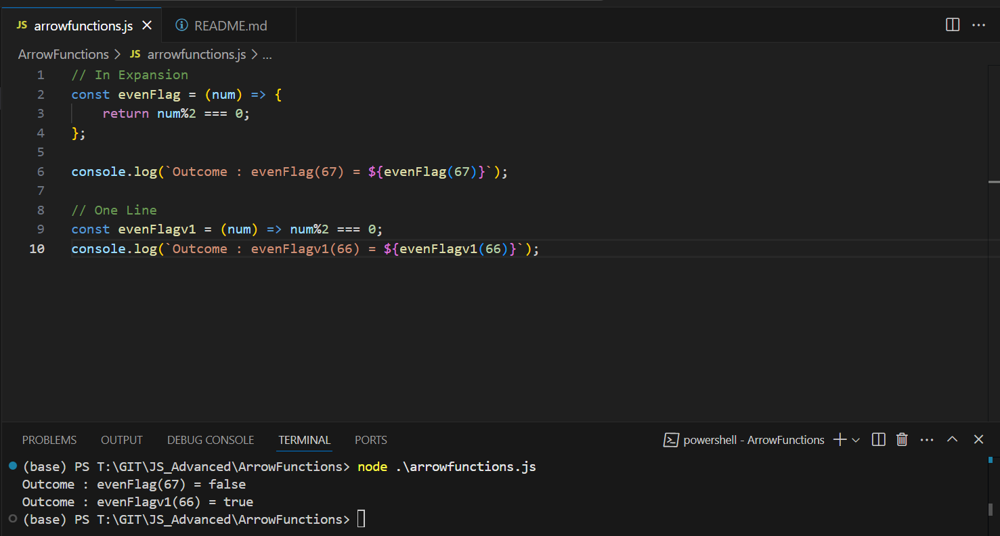

Arrow Function

```js
// In Expansion
const evenFlag = (num) => {
    return num%2 === 0;
};

console.log(`Outcome : evenFlag(67) = ${evenFlag(67)}`);

// One Line
const evenFlagv1 = (num) => num%2 === 0;
console.log(`Outcome : evenFlagv1(66) = ${evenFlagv1(66)}`);

```

Outcome
